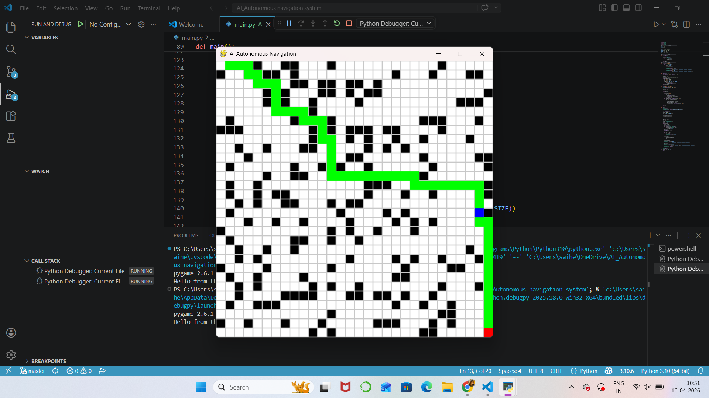
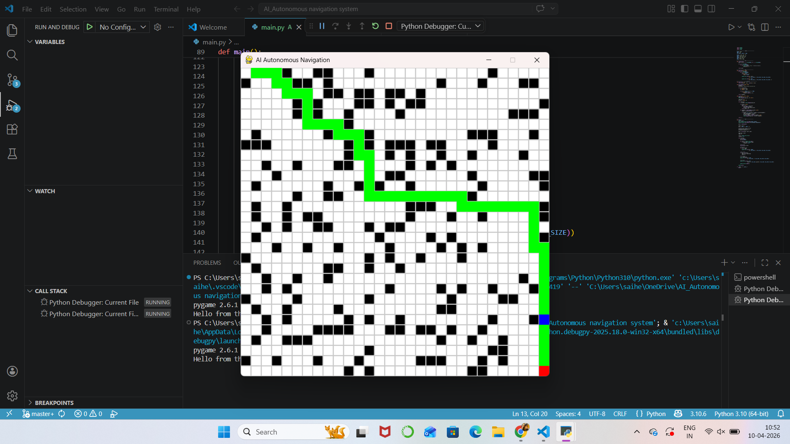
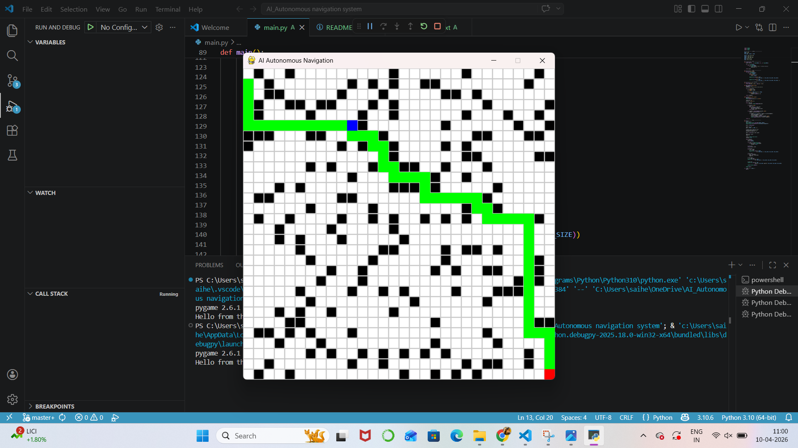
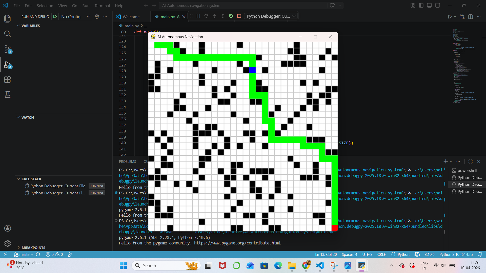

# 🚗 AI-Based Autonomous Navigation System

## 📌 Project Overview
This project simulates an AI-based autonomous navigation system using Python and Pygame.  
The system finds the shortest path from a start point to a goal while avoiding obstacles using the **A* (A-Star) Algorithm**.

---

## 🚀 Features
- Grid-based environment
- Random obstacle generation
- A* pathfinding algorithm
- Autonomous agent navigation
- Real-time visualization using Pygame

---

## 🛠️ Tech Stack
- Python
- Pygame
- NumPy

---

## 📸 Output Screenshots

## 🎥 Demo Video

[Click here to watch demo](output/videos/AI navigation.mp4)

## 🚀 Future Improvements

* Real-time object detection
* Self-driving simulation
* Reinforcement learning

## 👨‍💻 Author

S.Hemalatha